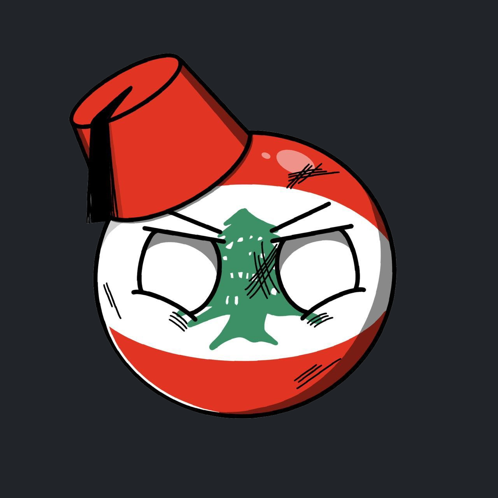

#  Moussadex 

## Live Website
http://moussadex.com/

until the API is updated you need to bypass CORS on your browser which can be done with [this](https://addons.mozilla.org/en-US/firefox/addon/cors-everywhere/) on firefox and [this](https://chrome.google.com/webstore/detail/allow-cors-access-control/lhobafahddgcelffkeicbaginigeejlf?hl=en) on chrome.

## About
This is a mangadex frontend, created because mangadex has been down for a few months but the API is back up. This project was inteded for learning web development and Vue3.

I AM NOT RESPOSIBLE FOR ANY OF THE CONTENT THAT MANGADEX HOSTS, THIS IS SIMPLY A FRONT END SERVICE.

THERE IS UNFORTUNATELY NSFW CONTENT AND THE API DOES NOT ALLOW FOR IT TO BE FILTERED OUT.
